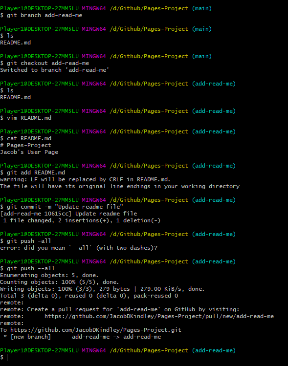

## Jacob Kindley

#### Proficient Languages:
- *Java*
- *C++*
- *C*

#### Random Quote
>  It is easier to act yourself into a new way of thinking, than it is to think yourself into a new way of acting.
**Millard Fuller**

#### Code Quote
`System.out.println("Hello World");`

#### External Link
[Really Interesting](https://www.youtube.com/watch?v=dQw4w9WgXcQ)

#### Todo List
- [ ] Learn Python

#### Relative Link
[Link to README](/README.md)

#### Image

